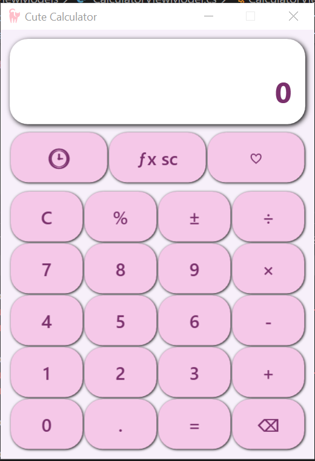
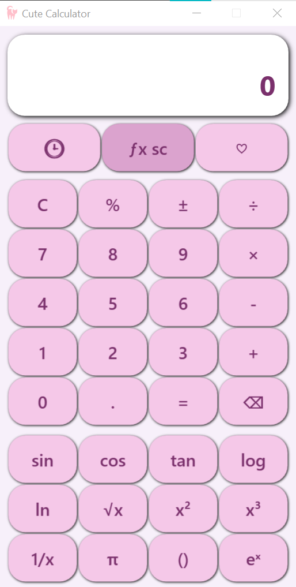
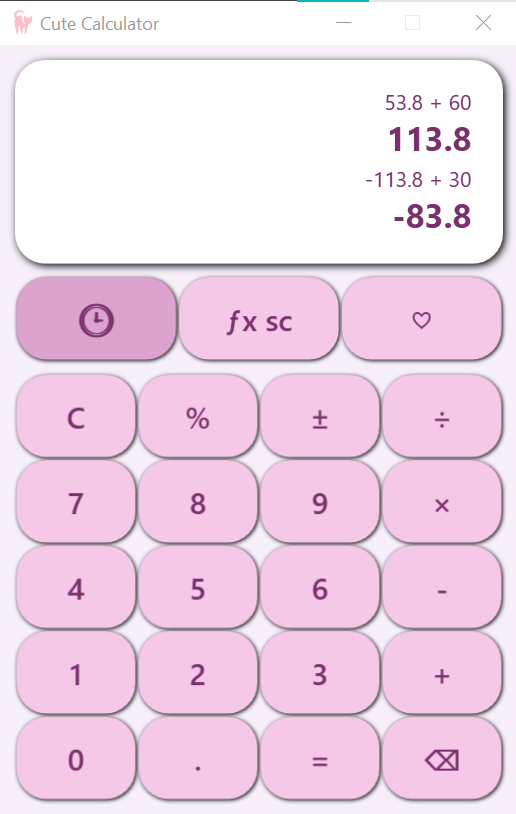

# CuteCalculator done by aicha khorchani

CuteCalculator is a WPF desktop calculator application built with **C# / .NET** following the **MVVM architecture**.  
It supports standard arithmetic operations as well as scientific functions and is partionly covered by automated unit tests.

## Screenshots

### Main Window


### Scientific Operations


### Memory Features


----------------------------------------------------
##  Features

- Standard operations: `+`, `-`, `×`, `÷`
- Scientific functions:
  - Square, Square Root
  - Power
  - Log, Ln
  - Sin, Cos, Tan
  - Factorial
  - Percentage, Reciprocal
- Calculation history (last 2 operations)
- Error handling for invalid operations (e.g. ln of negative numbers)
- Clean MVVM separation
- Unit-tested logic (xUnit)

----------------------------------------------------------------------------

## Project Structure

<details>
<summary>Click to expand project folder structure</summary>

```text
cutecalculator/
├── cutecalculator/         # Main WPF application
│   ├── Views/              # XAML views (UI)
│   ├── ViewModels/         # ViewModels (logic & state)
│   ├── Models/             # Domain models & enums
│   ├── Services/           # Operations & calculation logic
│   ├── Converters/         # WPF value converters
│   ├── Assets/             # Icons and resources
│   └── App.xaml            # Application entry point
├── CuteCalculator.Tests/    # Unit tests (xUnit)
│   ├── Memory/             # State & memory behavior tests
│   ├── Scientific/         # Scientific operation tests
│   └── Basic/              # Basic operation tests
└── cutecalculator.sln       # Solution file
</details>

-----------------------------------------------------------
##  Architecture Overview (MVVM)

- **Model**
  - Represents calculation state and domain logic
  - Examples: `OperationType`, `DisplayState`, `OperationResults`

- **View**
  - XAML UI (buttons, display, layout)
  - No business logic

- **ViewModel**
  - Handles all calculator logic and state transitions
  - Exposes bindable properties (`DisplayText`, `FormulaText`)
  - Commands handle user interactions

- **Services**
  - Encapsulate calculation logic
  - Each operation (Sum, Ln, Sin, etc.) implements a common interface
  - Enables clean testing and extension

- **Converters**
  - Convert ViewModel values to UI-friendly representations
  - Example: Boolean → Visibility

----------------------------------------------------------------------

##  Requirements

- .NET SDK **9.0** or newer
- Windows (WPF application)

Check installed SDKs:
```bash
dotnet --list-sdks
-------------------------------------------------------------------------
Build the Application
From the repository root:
dotnet build
Build a specific project:
dotnet build cutecalculator
Run the Application
dotnet run --project cutecalculator
Run Unit Tests
Run all tests:
dotnet test
Run tests with detailed output:
dotnet test -v normal
---------------------------------------------------
Publish the Application
1 Framework-Dependent Deployment (smaller size)
Requires .NET installed on the target machine.
dotnet publish cutecalculator \
  -c Release \
  -r win-x64 \
  --self-contained false
Output:
cutecalculator/bin/Release/net9.0-windows/win-x64/publish/
2 Self-Contained Deployment (no .NET required)
Includes the .NET runtime.
dotnet publish cutecalculator \
  -c Release \
  -r win-x64 \
  --self-contained true
Output:
cutecalculator/bin/Release/net9.0-windows/win-x64/publish/
Run the app by launching:
cutecalculator.exe
------------------------------------------------------------
Testing Strategy
xUnit test framework
Tests focus on:
Scientific operation correctness
Calculator memory/state behavior
Error handling
ViewModels are tested independently of the UI
-------------------------------------------------------------
Future Improvements Inchallah
Keyboard input support
Theme switching (darker pink shade /current light shade)
Persistent history
Localization
More scientific functions
--------------------------------------------------------------
